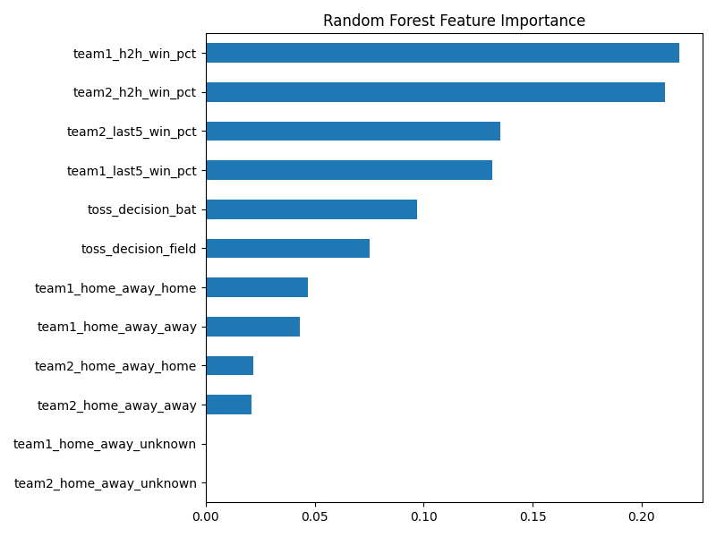

# 🏏 PSL Match Outcome Predictor

Predicts the winner of a Pakistan Super League (PSL) T20 match using historical team form, head-to-head record, toss, and venue — built end-to-end from raw match data to a deployed, interactive web app.

**[🔗 Live App](https://moazam-psl-predictor.streamlit.app)**


## Overview

This project parses 12 seasons of PSL match data (2015/16–2026, via Cricsheet), engineers leakage-safe predictive features, compares four classification models, and deploys the best-performing one as a Streamlit app with live interpretability.

## Dataset

- **Source:** [Cricsheet](https://cricsheet.org) — ball-by-ball structured match data.
- **350 valid matches** parsed across 12 PSL seasons (7 no-result/abandoned matches excluded).
- Match-level fields extracted: teams, venue, toss winner/decision, batting order (derived from toss), and outcome.

## Feature Engineering

All rolling/historical features are computed using **only data available before each match** (via `.shift(1)` on chronologically sorted data) to avoid look-ahead bias:

- **Last-5 match win rate** per team (rolling form)
- **Head-to-head win rate** between the specific pair of teams playing
- **Home/away status** (team-to-home-city mapping)
- **Toss winner and decision**

Missing values for first-ever team appearances/matchups are filled with a neutral **0.5** (not 0), since a team with no history isn't a guaranteed loser.

## Model Comparison

Time-based split: trained on 2015/16–2023/24 (274 matches), tested on 2025+2026 (76 matches) — no random shuffling, since it would leak future information into training.

| Model | Accuracy | Precision | Recall | F1 | ROC-AUC |
|---|---|---|---|---|---|
| Logistic Regression | 0.526 | 0.467 | 0.636 | 0.538 | **0.591** |
| Random Forest | 0.513 | 0.462 | 0.727 | 0.565 | 0.563 |
| XGBoost | 0.500 | 0.451 | 0.697 | 0.548 | 0.577 |
| LightGBM | 0.526 | 0.473 | 0.788 | 0.591 | 0.563 |

**Logistic Regression performed best on ROC-AUC**, including outperforming more complex ensemble models — likely because with only 274 training rows, simpler models generalize more reliably than high-variance ones. An earlier version using raw team/venue identity as one-hot features scored **ROC-AUC 0.471 (worse than random)**; removing those high-cardinality columns in favor of engineered features raised it to 0.591.

## Interpretability

Random Forest feature importance and SHAP values (Logistic Regression) were computed and **disagreed** on which features mattered most — Random Forest ranked head-to-head record highest, while SHAP on the deployed Logistic Regression model ranked toss decision and home/away higher. This reflects a real property of the two model types: linear models capture different relationships than tree-based models, so "feature importance" isn't a single objective truth.



## Web App

A Streamlit app lets you pick two teams, a venue, and toss details, and get a live prediction with a win-probability chart and real head-to-head history for that specific matchup.

**[Try it live →](https://moazam-psl-predictor.streamlit.app)**

## Tech Stack

Python · pandas · scikit-learn · XGBoost · LightGBM · SHAP · Streamlit

## Known Limitations

- Home/away signal is weak for early seasons (2016–2019), which were hosted entirely in the UAE.
- Two teams (Islamabad United, Peshawar Zalmi) share a listed home city (Rawalpindi), so the home/away feature can't distinguish a true away game in that specific matchup.
- Dataset is limited to 350 matches — a realistic constraint for a domestic T20 league, but it limits how much signal complex models can extract compared to simpler ones.

## Project Structure

```
psl-match-predictor/
├── data/
│   ├── raw/            # Cricsheet JSON files
│   └── processed/      # cleaned matches.csv, features.csv
├── src/
│   ├── parse_data.py       # raw JSON → match-level CSV
│   ├── build_features.py   # feature engineering (leakage-safe)
│   ├── train_model.py      # model training, comparison, SHAP
│   └── app.py               # Streamlit app
├── reports/             # saved plots (feature importance, SHAP)
└── requirements.txt
```